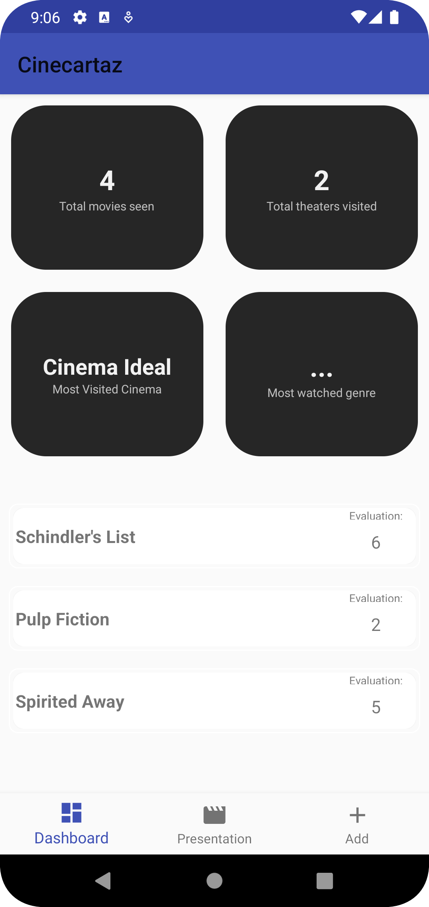
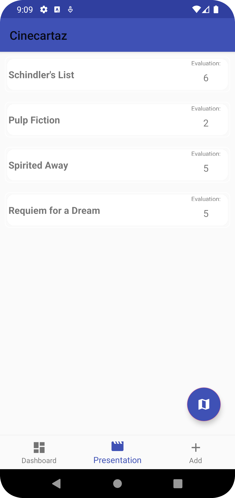
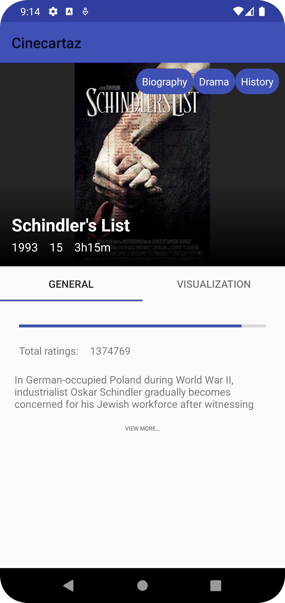
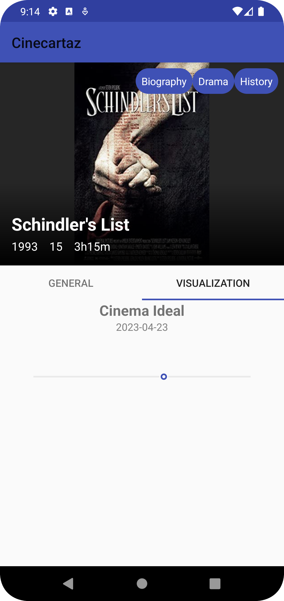
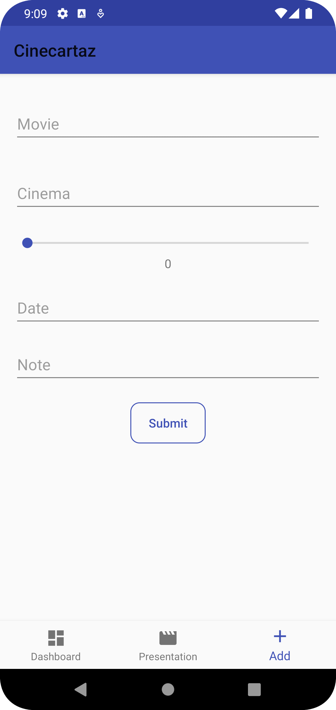

Trabalho realizado por: **Filipe Parreiras | a21905158**

## Screenshots dos ecrãs:

  
Dashboard:

  

 

  
Apresentação dos filmes:

  

 

  
Detalhe do filme:

  
  

 

  
Registo de filmes:

  

## Filmes registados na aplicação:

1. Schindler's List
2. Pulp Fiction
3. Spirited Away
4. Joker
5. Requiem for a Dream
6. Vertigo
7. Ikiru

## Funcionalidades Implementadas

| Funcionalidade                                     | Implementada       |
|----------------------------------------------------|--------------------|
| Dashboard                                          | :white_check_mark: |
| Apresentação dos filmes - Lista                    | :white_check_mark: |
| Apresentação dos filmes - Lista - Rotação          | :white_check_mark: |
| Apresentação dos filmes - Mapa(Imagem)             | :white_check_mark: |
| Detalhe do filme (sem fotografias)                 | :white_check_mark: |
| Detalhe do filme (apenas a parte das fotografias)  |                    |
| Pesquisa de filmes por voz                         |                    |
| Registo de filmes (sem fotografias)                | :white_check_mark: |
| Registo de filmes (apenas a parte das fotografias) |                    |
| Suporte Multi-Idioma                               | :white_check_mark: |
| Navegabilidade                                     | :white_check_mark: |
| Extra                                              |                    |

## Previsão de nota

13 valores

## Classes de lógica de negócio
- ### Cinema
  - Atributos
    - id -> Int
    - nome -> String
    - latitude -> Double
    - Longitude -> Double
  - Métodos
    - Nenhum
  - Descrição
    - Permite que o utilizador crie um filme tendo em conta a localização onde o assistiu.
- ### Duracao
  - Atributos
    - minutos -> Int 
  - Métodos
    - override toString()
  - Descrição
    - Utilizada para criar filme
- ### Filme
  - Atributos
    - title -> String
    - year -> Int
    - rated -> String
    - runtime -> Duracao
    - genre -> String
    - plot -> String
    - poster -> String
    - imdbRating -> Double
  - Métodos
    - Nenhum
  - Descrição
    - Contém o conjunto de informaçōes necessárias para apresentar dados gerais do filme ao utilizador.
- ### Visualizacao
  - Atributos
    - filme -> Filme
    - cinema -> Cinema
    - avaliacao -> Int
    - data -> Date
    - fotos -> List<Uri>
    - observacoes -> String
  - Métodos
    - getDate(): String
  - Descrição
    - Engloba todas as outras classes e é com esta que o utilizador regista as visualizações.

## Idioma gerado

Para o suporte multi-idioma não foi utilizada a ferramenta ChatGPT visto que, neste caso, a documentação oficial do Android apresentou uma solução simples/de fácil compreensão.

  [Documentação utilizada](https://developer.android.com/training/basics/supporting-devices/languages)

## Fontes de Informação

1. [Android Documentation](https://developer.android.com/docs)
2. [ChatGPT](https://chat.openai.com/)
3. [Codepath](https://guides.codepath.com/android/Displaying-Images-with-the-Glide-Library)